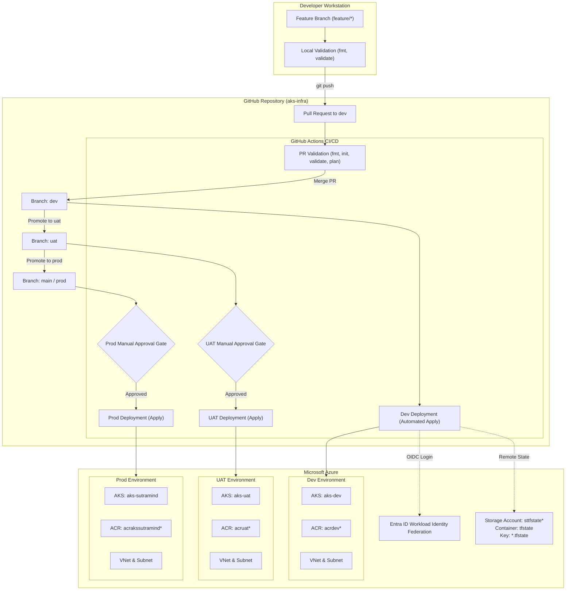

# Enterprise CI/CD Pipeline & Infrastructure Guide
## Azure Kubernetes Service (AKS), Terraform, Git & GitHub Actions

This document provides comprehensive documentation for the automated infrastructure CI/CD pipeline powering the **Azure Kubernetes Service (AKS)** platform. It covers architecture, Git branching models, GitHub Actions workflows with environment approvals, OIDC passwordless authentication, and real-world issues resolved during implementation.

---

## Table of Contents
1. [Architecture Overview](#1-architecture-overview)
2. [Infrastructure Components (Terraform)](#2-infrastructure-components-terraform)
3. [Git Branching Strategy (Dev, UAT, Prod & Feature Branches)](#3-git-branching-strategy)
4. [GitHub Actions CI/CD Pipeline with Approval Gates](#4-github-actions-cicd-pipeline-with-approval-gates)
5. [Azure Entra ID & OIDC Federation (Passwordless)](#5-azure-entra-id--oidc-federation)
6. [Troubleshooting & Issues Resolved During Implementation](#6-troubleshooting--issues-resolved-during-implementation)
7. [Step-by-Step Feature Branch Development Workflow](#7-step-by-step-feature-branch-development-workflow)
8. [Production Best Practices & Security Checklist](#8-production-best-practices--security-checklist)

---

## 1. Architecture Overview

The pipeline implements GitOps principles: every infrastructure change is declared in code, validated on Pull Requests, and deployed systematically through environments (`dev` → `uat` → `prod`) with automated checks and manual approval gates.



---

## 2. Infrastructure Components (Terraform)

All Azure resources are defined modularly using HashiCorp Terraform with the `azurerm` provider (v4.x).

| Component | File | Description |
|---|---|---|
| **Networking** | `network.tf` | Virtual Network (`10.0.0.0/16`) and Subnet (`10.0.1.0/24`) for AKS node pools and pod CIDRs. |
| **Container Registry** | `acr.tf` | Azure Container Registry (Basic SKU) for storing application container images. |
| **Kubernetes Cluster** | `aks.tf` | AKS Managed Cluster with Azure Linux OS, Azure CNI Overlay networking, and Workload Identity. |
| **Remote State** | `backend.tf` | Azure Blob Storage backend (`azurerm`) with state locking and Entra ID authentication. |
| **Identity & Access** | `aks.tf`, `acr.tf` | RBAC role assignments: `AcrPull` (Kubelet → ACR) and `Network Contributor` (Cluster → VNet). |
| **Variables & Locals** | `variables.tf`, `locals.tf` | Dynamic naming conventions, region selection, and node pool configurations. |

### Remote State Backend Architecture
Terraform state is stored securely in Azure Blob Storage:
```hcl
terraform {
  backend "azurerm" {
    # Dynamically injected via backend-config in CI/CD:
    # resource_group_name  = "rg-tfstate"
    # storage_account_name = "sttfstate1akc4957"
    # container_name       = "tfstate"
    # key                  = "aks-infra.tfstate"
    # use_azuread_auth     = true
    # use_oidc             = true
  }
}
```
- **Concurrency Protection**: Azure Blob Storage automatically provides native blob leasing (locking) to prevent simultaneous deployments from corrupting state.
- **Secretless Authentication**: `use_azuread_auth = true` and `use_oidc = true` instruct Terraform to authenticate against Azure Blob Storage via Entra ID tokens rather than static storage account keys.

---

## 3. Git Branching Strategy

To maintain stability across environments while supporting fast iterations, the repository adopts an Environment-Branch Git model combined with short-lived Feature Branches.

```mermaid
gitGraph
    commit id: "Initial Commit"
    branch dev
    checkout dev
    commit id: "Dev Initial"
    branch feature/add-ingress
    checkout feature/add-ingress
    commit id: "feat: add ingress controller"
    commit id: "feat: update variables"
    checkout dev
    merge feature/add-ingress id: "PR #1 Merged (Apply Dev)"
    branch uat
    checkout uat
    merge dev id: "PR #2 Merged (Approval -> Apply UAT)"
    checkout main
    merge uat id: "PR #3 Merged (Approval -> Apply Prod)"
```

### Branch Hierarchy

1. **`feature/*` / `bugfix/*` Branches**:
   - Created from: `dev`.
   - Purpose: Isolated development of new infrastructure components, SKU changes, or configuration tweaks.
   - Lifetime: Short-lived (hours to days).
   - Rules: Never deployed directly; must open a Pull Request targeting `dev`.

2. **`dev` Branch**:
   - Purpose: Continuous Integration for development.
   - Trigger: Any PR merge into `dev` automatically triggers `terraform plan` and `terraform apply` against the Dev Azure environment.
   - Protection: Requires 1 peer review; requires PR validation pipeline to pass.

3. **`uat` Branch (User Acceptance Testing / Staging)**:
   - Purpose: Mirror of production for pre-flight testing and verification.
   - Trigger: Merges or promotional PRs from `dev` to `uat`.
   - Pipeline: Runs `terraform plan`, then pauses at the **UAT GitHub Environment** approval gate.
   - Gate: Requires approval from designated QA / Lead Engineer before `terraform apply` executes.

4. **`main` / `prod` Branch (Production)**:
   - Purpose: Production environment infrastructure.
   - Trigger: Promotional PR from `uat` to `main`.
   - Pipeline: Runs `terraform plan`, publishes artifact, and halts at the **Production GitHub Environment** approval gate.
   - Gate: Requires 2 approvals (e.g. Lead DevOps / Security / Infrastructure Manager) before `terraform apply` executes.

---

## 4. GitHub Actions CI/CD Pipeline with Approval Gates

### Setting Up GitHub Environments & Approval Gates

To enable manual approvals:
1. Navigate to your GitHub repository: **Settings → Environments**.
2. Click **New environment** and create:
   - `dev` (No reviewers required).
   - `uat` (Add required reviewers, e.g. QA Leads).
   - `prod` (Add required reviewers, e.g. DevOps Leads).
3. Under **Deployment protection rules**:
   - Check **Required reviewers** and assign authorized team members or groups.
   - Check **Limit which branches can deploy to this environment** (e.g. only `uat` for UAT, only `main` for Production).
4. Under **Environment variables**, define environment-specific variables:
   - `TF_STATE_KEY`: `aks-dev.tfstate`, `aks-uat.tfstate`, `aks-prod.tfstate`
   - `TF_VAR_cluster_name`: `aks-dev`, `aks-uat`, `aks-sutramind`
   - `TF_VAR_resource_group_name`: `rg-aks-dev`, `rg-aks-uat`, `aks-sutramind-rg`

---

### Multi-Environment Workflow Specification (`.github/workflows/terraform.yml`)

Below is the production-grade multi-environment GitHub Actions workflow file:

```yaml
name: Terraform CI/CD

on:
  pull_request:
    branches: [dev, uat, main]
  push:
    branches: [dev, uat, main]
  workflow_dispatch:
    inputs:
      target_env:
        description: 'Target Environment'
        required: true
        default: 'dev'
        type: choice
        options:
          - dev
          - uat
          - prod

permissions:
  id-token: write
  contents: write
  pull-requests: write

env:
  TF_IN_AUTOMATION: "true"
  ARM_USE_OIDC: "true"
  ARM_USE_AZUREAD: "true"

jobs:
  # ============================================================================
  # 1. Validation & Plan on Pull Request
  # ============================================================================
  pr-validation:
    name: Validate & Plan PR
    if: github.event_name == 'pull_request'
    runs-on: ubuntu-latest
    steps:
      - name: Checkout Code
        uses: actions/checkout@v4

      - name: Resolve Azure OIDC Identity
        id: azure
        run: |
          CLIENT_ID="$(echo "${{ vars.AZURE_CLIENT_ID }}" | tr -d '[:space:]')"
          TENANT_ID="$(echo "${{ vars.AZURE_TENANT_ID }}" | tr -d '[:space:]')"
          SUBSCRIPTION_ID="$(echo "${{ vars.AZURE_SUBSCRIPTION_ID }}" | tr -d '[:space:]')"
          echo "client_id=$CLIENT_ID" >> "$GITHUB_OUTPUT"
          echo "tenant_id=$TENANT_ID" >> "$GITHUB_OUTPUT"
          echo "subscription_id=$SUBSCRIPTION_ID" >> "$GITHUB_OUTPUT"

      - name: Azure Login via OIDC
        uses: azure/login@v3
        with:
          client-id: ${{ steps.azure.outputs.client_id }}
          tenant-id: ${{ steps.azure.outputs.tenant_id }}
          subscription-id: ${{ steps.azure.outputs.subscription_id }}

      - name: Setup Terraform
        uses: hashicorp/setup-terraform@v3
        with:
          terraform_version: "1.9.8"
          terraform_wrapper: false

      - name: Terraform Format Check
        run: terraform fmt -check -recursive

      - name: Generate Backend Configuration
        run: |
          TARGET_BRANCH="${{ github.base_ref }}"
          case "$TARGET_BRANCH" in
            uat) STATE_KEY="aks-uat.tfstate" ;;
            main) STATE_KEY="aks-prod.tfstate" ;;
            *) STATE_KEY="aks-dev.tfstate" ;;
          esac

          cat <<EOF > backend.hcl
          resource_group_name  = "${{ vars.TF_STATE_RESOURCE_GROUP || 'rg-tfstate' }}"
          storage_account_name = "${{ vars.TF_STATE_STORAGE_ACCOUNT || 'sttfstate1akc4957' }}"
          container_name       = "${{ vars.TF_STATE_CONTAINER || 'tfstate' }}"
          key                  = "$STATE_KEY"
          use_azuread_auth     = true
          use_oidc             = true
          subscription_id      = "${{ steps.azure.outputs.subscription_id }}"
          tenant_id            = "${{ steps.azure.outputs.tenant_id }}"
          client_id            = "${{ steps.azure.outputs.client_id }}"
          EOF

      - name: Terraform Init
        run: terraform init -input=false -reconfigure -backend-config=backend.hcl

      - name: Terraform Validate
        run: terraform validate

      - name: Terraform Plan
        run: |
          NODE_VM_SIZE="${{ vars.TF_VAR_node_vm_size || 'Standard_B2s_v2' }}"
          if [ "$NODE_VM_SIZE" = "Standard_B2s" ]; then
            NODE_VM_SIZE="Standard_B2s_v2"
          fi
          terraform plan -input=false -out=tfplan \
            -var="subscription_id=${{ steps.azure.outputs.subscription_id }}" \
            -var="node_vm_size=$NODE_VM_SIZE"
          terraform show -no-color tfplan > tfplan.txt

      - name: Post Plan to PR
        uses: actions/github-script@v7
        with:
          script: |
            const fs = require('fs');
            const plan = fs.readFileSync('tfplan.txt', 'utf8');
            const truncated = plan.length > 60000 ? plan.substring(0, 60000) + '\n\n… [truncated] …' : plan;
            const body = `### Terraform Plan Result (${{ github.base_ref }})\n\`\`\`\n${truncated}\n\`\`\`\n*Pusher: @${{ github.actor }}*`;
            github.rest.issues.createComment({
              issue_number: context.issue.number,
              owner: context.repo.owner,
              repo: context.repo.repo,
              body
            });

  # ============================================================================
  # 2. Deploy to Development (Auto Apply on push to 'dev')
  # ============================================================================
  deploy-dev:
    name: Deploy to Dev
    if: (github.ref == 'refs/heads/dev' && github.event_name == 'push') || (github.event_name == 'workflow_dispatch' && inputs.target_env == 'dev')
    runs-on: ubuntu-latest
    environment: dev
    steps:
      - name: Checkout Code
        uses: actions/checkout@v4

      - name: Resolve OIDC IDs
        id: azure
        run: |
          echo "client_id=$(echo '${{ vars.AZURE_CLIENT_ID }}' | tr -d '[:space:]')" >> "$GITHUB_OUTPUT"
          echo "tenant_id=$(echo '${{ vars.AZURE_TENANT_ID }}' | tr -d '[:space:]')" >> "$GITHUB_OUTPUT"
          echo "subscription_id=$(echo '${{ vars.AZURE_SUBSCRIPTION_ID }}' | tr -d '[:space:]')" >> "$GITHUB_OUTPUT"

      - name: Azure Login via OIDC
        uses: azure/login@v3
        with:
          client-id: ${{ steps.azure.outputs.client_id }}
          tenant-id: ${{ steps.azure.outputs.tenant_id }}
          subscription-id: ${{ steps.azure.outputs.subscription_id }}

      - name: Setup Terraform
        uses: hashicorp/setup-terraform@v3
        with:
          terraform_version: "1.9.8"

      - name: Terraform Init & Apply
        run: |
          cat <<EOF > backend.hcl
          resource_group_name  = "${{ vars.TF_STATE_RESOURCE_GROUP || 'rg-tfstate' }}"
          storage_account_name = "${{ vars.TF_STATE_STORAGE_ACCOUNT || 'sttfstate1akc4957' }}"
          container_name       = "${{ vars.TF_STATE_CONTAINER || 'tfstate' }}"
          key                  = "aks-dev.tfstate"
          use_azuread_auth     = true
          use_oidc             = true
          subscription_id      = "${{ steps.azure.outputs.subscription_id }}"
          tenant_id            = "${{ steps.azure.outputs.tenant_id }}"
          client_id            = "${{ steps.azure.outputs.client_id }}"
          EOF
          terraform init -input=false -reconfigure -backend-config=backend.hcl
          terraform apply -input=false -auto-approve \
            -var="subscription_id=${{ steps.azure.outputs.subscription_id }}" \
            -var="cluster_name=aks-dev" \
            -var="resource_group_name=rg-aks-dev" \
            -var="node_vm_size=Standard_B2s_v2"

  # ============================================================================
  # 3. Deploy to UAT (Manual Approval Gate via 'uat' Environment)
  # ============================================================================
  deploy-uat:
    name: Deploy to UAT (Approval Required)
    if: (github.ref == 'refs/heads/uat' && github.event_name == 'push') || (github.event_name == 'workflow_dispatch' && inputs.target_env == 'uat')
    runs-on: ubuntu-latest
    environment: uat # Triggers GitHub Environment Approval Gate
    steps:
      - name: Checkout Code
        uses: actions/checkout@v4

      - name: Resolve OIDC IDs
        id: azure
        run: |
          echo "client_id=$(echo '${{ vars.AZURE_CLIENT_ID }}' | tr -d '[:space:]')" >> "$GITHUB_OUTPUT"
          echo "tenant_id=$(echo '${{ vars.AZURE_TENANT_ID }}' | tr -d '[:space:]')" >> "$GITHUB_OUTPUT"
          echo "subscription_id=$(echo '${{ vars.AZURE_SUBSCRIPTION_ID }}' | tr -d '[:space:]')" >> "$GITHUB_OUTPUT"

      - name: Azure Login via OIDC
        uses: azure/login@v3
        with:
          client-id: ${{ steps.azure.outputs.client_id }}
          tenant-id: ${{ steps.azure.outputs.tenant_id }}
          subscription-id: ${{ steps.azure.outputs.subscription_id }}

      - name: Setup Terraform
        uses: hashicorp/setup-terraform@v3
        with:
          terraform_version: "1.9.8"

      - name: Terraform Init & Apply
        run: |
          cat <<EOF > backend.hcl
          resource_group_name  = "${{ vars.TF_STATE_RESOURCE_GROUP || 'rg-tfstate' }}"
          storage_account_name = "${{ vars.TF_STATE_STORAGE_ACCOUNT || 'sttfstate1akc4957' }}"
          container_name       = "${{ vars.TF_STATE_CONTAINER || 'tfstate' }}"
          key                  = "aks-uat.tfstate"
          use_azuread_auth     = true
          use_oidc             = true
          subscription_id      = "${{ steps.azure.outputs.subscription_id }}"
          tenant_id            = "${{ steps.azure.outputs.tenant_id }}"
          client_id            = "${{ steps.azure.outputs.client_id }}"
          EOF
          terraform init -input=false -reconfigure -backend-config=backend.hcl
          terraform apply -input=false -auto-approve \
            -var="subscription_id=${{ steps.azure.outputs.subscription_id }}" \
            -var="cluster_name=aks-uat" \
            -var="resource_group_name=rg-aks-uat" \
            -var="node_vm_size=Standard_B2s_v2"

  # ============================================================================
  # 4. Deploy to Production (Manual Approval Gate via 'prod' Environment)
  # ============================================================================
  deploy-prod:
    name: Deploy to Production (Approval Required)
    if: (github.ref == 'refs/heads/main' && github.event_name == 'push') || (github.event_name == 'workflow_dispatch' && inputs.target_env == 'prod')
    runs-on: ubuntu-latest
    environment: prod # Triggers GitHub Environment Approval Gate
    steps:
      - name: Checkout Code
        uses: actions/checkout@v4

      - name: Resolve OIDC IDs
        id: azure
        run: |
          echo "client_id=$(echo '${{ vars.AZURE_CLIENT_ID }}' | tr -d '[:space:]')" >> "$GITHUB_OUTPUT"
          echo "tenant_id=$(echo '${{ vars.AZURE_TENANT_ID }}' | tr -d '[:space:]')" >> "$GITHUB_OUTPUT"
          echo "subscription_id=$(echo '${{ vars.AZURE_SUBSCRIPTION_ID }}' | tr -d '[:space:]')" >> "$GITHUB_OUTPUT"

      - name: Azure Login via OIDC
        uses: azure/login@v3
        with:
          client-id: ${{ steps.azure.outputs.client_id }}
          tenant-id: ${{ steps.azure.outputs.tenant_id }}
          subscription-id: ${{ steps.azure.outputs.subscription_id }}

      - name: Setup Terraform
        uses: hashicorp/setup-terraform@v3
        with:
          terraform_version: "1.9.8"

      - name: Terraform Init & Apply
        run: |
          cat <<EOF > backend.hcl
          resource_group_name  = "${{ vars.TF_STATE_RESOURCE_GROUP || 'rg-tfstate' }}"
          storage_account_name = "${{ vars.TF_STATE_STORAGE_ACCOUNT || 'sttfstate1akc4957' }}"
          container_name       = "${{ vars.TF_STATE_CONTAINER || 'tfstate' }}"
          key                  = "aks-infra.tfstate"
          use_azuread_auth     = true
          use_oidc             = true
          subscription_id      = "${{ steps.azure.outputs.subscription_id }}"
          tenant_id            = "${{ steps.azure.outputs.tenant_id }}"
          client_id            = "${{ steps.azure.outputs.client_id }}"
          EOF
          terraform init -input=false -reconfigure -backend-config=backend.hcl
          terraform apply -input=false -auto-approve \
            -var="subscription_id=${{ steps.azure.outputs.subscription_id }}" \
            -var="node_vm_size=Standard_B2s_v2"

      - name: Print Downstream Environment Outputs
        run: |
          echo "### Production Cluster Outputs ###"
          echo "ACR_NAME=$(terraform output -raw acr_name)"
          echo "AKS_RESOURCE_GROUP=$(terraform output -raw resource_group_name)"
          echo "AKS_CLUSTER_NAME=$(terraform output -raw cluster_name)"
          echo "ACR_LOGIN_SERVER=$(terraform output -raw acr_login_server)"
```

---

## 5. Azure Entra ID & OIDC Federation (Passwordless)

The deployment uses **Workload Identity Federation** (OpenID Connect). No client secrets, passwords, or long-lived certificates are stored in GitHub.

### Configured Federated Credentials on App Registration `github-aks-cicd` (`7fb279a6-3958-4b90-949d-3df9009cdcae`):

| Credential Name | Subject Identifier | Scope / Branch |
|---|---|---|
| `aks-infra-main-immutable` | `repo:sunilkrdeep@15242155/aks-infra@1362295953:ref:refs/heads/main` | Production Branch |
| `aks-infra-dev-immutable` | `repo:sunilkrdeep@15242155/aks-infra@1362295953:ref:refs/heads/dev` | Dev Branch |
| `aks-infra-uat-immutable` | `repo:sunilkrdeep@15242155/aks-infra@1362295953:ref:refs/heads/uat` | UAT Branch |
| `aks-infra-pr-immutable` | `repo:sunilkrdeep@15242155/aks-infra@1362295953:pull_request` | Any Pull Request |
| `sample-app-main-immutable` | `repo:sunilkrdeep@15242155/sample-app@1362298528:ref:refs/heads/main` | App Deployment |

### Required Azure RBAC Roles:
1. **Subscription Level**:
   - `Contributor`: Allows creating and managing Virtual Networks, Subnets, ACR, and AKS Clusters.
   - `User Access Administrator`: Required so Terraform can assign `AcrPull` (ACR) and `Network Contributor` (VNet) roles to AKS identities.
2. **Storage Account Level (`rg-tfstate`)**:
   - `Storage Blob Data Owner`: Allows Terraform to acquire state leases, read, and write `*.tfstate` blobs using Azure AD credentials.

---

## 6. Troubleshooting & Issues Resolved During Implementation

During the initial deployment of the AKS CI/CD pipeline, several real-world enterprise issues were diagnosed and fixed. This post-mortem serves as an operational reference.

### Issue 1: OIDC Subject Mismatch (`AADSTS700213`)
- **Error Output**:
  ```text
  Error: AADSTS700213: No matching federated identity record found for presented assertion subject 
  'repo:sunilkrdeep@15242155/aks-infra@1362295953:ref:refs/heads/main'.
  Check your federated identity credential Subject, Audience and Issuer against the presented assertion.
  ```
- **Root Cause**:
  GitHub Actions tokens automatically emit immutable numeric entity identifiers (`@<owner_id>` and `@<repo_id>`) in the subject claim. The original Azure Entra ID app only had classical name-based subjects (`repo:sunilkrdeep/aks-infra:ref:refs/heads/main`). Entra ID requires exact character-for-character equality.
- **Solution**:
  Updated the federated identity credentials on the Azure App Registration using Azure CLI to match the exact immutable assertion subject:
  ```powershell
  az ad app federated-credential create --id "1a3a779f-1d0e-40d9-b90c-c7e111a26a47" `
    --parameters '{"name":"aks-infra-main-immutable","issuer":"https://token.actions.githubusercontent.com","subject":"repo:sunilkrdeep@15242155/aks-infra@1362295953:ref:refs/heads/main","audiences":["api://AzureADTokenExchange"]}'
  ```

---

### Issue 2: Hidden Newline/Whitespace in GitHub Variables Corrupting `backend.hcl`
- **Error Output**:
  ```text
  Error: Failed to parse backend configuration
  Invalid multiline string or unexpected token in backend.hcl
  ```
- **Root Cause**:
  Copy-pasting variables like `TF_STATE_CONTAINER` into GitHub Repository Settings inadvertently included a leading tab and newline. When written to `backend.hcl`, it caused syntax errors in Terraform.
- **Solution**:
  Sanitized all environment variables in the workflow using `tr -d '[:space:]'`:
  ```bash
  STATE_CONTAINER="$(echo "${{ vars.TF_STATE_CONTAINER }}" | tr -d '[:space:]')"
  ```

---

### Issue 3: AKS VM SKU Not Available in Region (`southindia`)
- **Error Output**:
  ```text
  Error: creating Managed Cluster: (Code="VmSizeNotSupported") 
  VirtualMachineSize 'Standard_B2s' is not supported in location 'southindia' for the specified cluster configuration.
  ```
- **Root Cause**:
  In Azure `southindia`, the older B-series SKU `Standard_B2s` is restricted or deprecated for Managed AKS agent pools. The current supported generation is `Standard_B2s_v2`.
- **Solution**:
  1. Updated `terraform.tfvars`: `aks_node_vm_size = "Standard_B2s_v2"`.
  2. Implemented dynamic fallback mapping in the GitHub Actions runner so existing variables configured as `Standard_B2s` automatically map to `Standard_B2s_v2`.

---

### Issue 4: RBAC Role Assignment Permission Denied (`403 Forbidden`)
- **Error Output**:
  ```text
  Error: unexpected status 403 (403 Forbidden) with error: AuthorizationFailed: 
  The client '7fb279a6-3958-4b90-949d-3df9009cdcae' does not have authorization to perform action 
  'Microsoft.Authorization/roleAssignments/write' over scope '.../registries/acrakssutramindpn7n/...'
  ```
- **Root Cause**:
  Terraform creates two role assignments:
  - `azurerm_role_assignment.aks_acr_pull`
  - `azurerm_role_assignment.aks_network`
  The GitHub CI/CD Service Principal only held the Azure built-in `Contributor` role. In Azure RBAC, `Contributor` does **not** grant permission to grant permissions (`Microsoft.Authorization/roleAssignments/write`).
- **Solution**:
  Granted `User Access Administrator` to the CI/CD Service Principal at the subscription scope:
  ```powershell
  az role assignment create `
    --assignee-object-id "b13bc842-841f-4895-a389-e06155672c3f" `
    --assignee-principal-type "ServicePrincipal" `
    --role "User Access Administrator" `
    --scope "/subscriptions/3a5237f2-fd9c-490b-a303-8bd660d58441"
  ```

---

## 7. Step-by-Step Feature Branch Development Workflow

Follow this guide whenever you need to add, modify, or test new infrastructure changes:

### Step 1: Sync with the `dev` branch
```bash
git checkout dev
git pull origin dev
```

### Step 2: Create a new feature branch
```bash
# Naming convention: feature/<short-description> or bugfix/<issue-description>
git checkout -b feature/enable-autoscaling
```

### Step 3: Implement your changes
Make the necessary edits in the Terraform files (e.g. updating `aks.tf` to enable autoscaling or updating `variables.tf`).

### Step 4: Validate locally
Before committing, verify syntax and formatting:
```bash
# Check and format code
terraform fmt -check -recursive
terraform fmt -recursive

# Validate syntax
terraform validate
```

### Step 5: Commit and push your feature branch
```bash
git add .
git commit -m "feat(aks): enable autoscaler profile and adjust min/max nodes"
git push -u origin feature/enable-autoscaling
```

### Step 6: Create a Pull Request (PR)
1. Open GitHub and navigate to the repository.
2. Create a Pull Request:
   - **Base**: `dev`
   - **Compare**: `feature/enable-autoscaling`
3. GitHub Actions will automatically trigger the `Validate & Plan PR` job:
   - Authenticates via OIDC.
   - Generates a speculative `terraform plan`.
   - Posts the full plan output directly as a comment on the PR.
4. Review the plan comment with your team.

### Step 7: Merge & Promote across Environments
1. **Merge into `dev`**:
   - Once approved, merge the PR.
   - GitHub Actions deploys the change automatically to the **Dev** AKS cluster.
2. **Promote to `uat`**:
   - Open a PR from `dev` into `uat`.
   - Once merged, the `Deploy to UAT` workflow halts at the **UAT Review Gate**.
   - Reviewer clicks **Review Deployments → Approve & Deploy**.
   - Change is applied to UAT AKS.
3. **Promote to `prod`**:
   - Open a PR from `uat` into `main`.
   - Once merged, the `Deploy to Production` workflow halts at the **Prod Review Gate**.
   - Lead Engineer / Approver clicks **Approve & Deploy**.
   - Change is applied safely to Production.

---

## 8. Production Best Practices & Security Checklist

- [x] **Zero Plaintext Secrets**: OIDC Workload Identity is enforced; no client secrets exist.
- [x] **State Encryption & Locking**: State is stored in Azure Blob Storage with HTTPS and Entra ID authentication.
- [x] **Least Privilege**: Only the designated Service Principal has deployment rights.
- [x] **Immunity to Drift**: Remote state backend is reconfigured on each run with `-reconfigure`.
- [x] **Auditability**: All plan outputs and apply logs are recorded in GitHub Action logs and commit comments.
- [x] **Downstream Hand-off**: ACR and Cluster details are exported for application deployment pipelines (`sample-app`).
